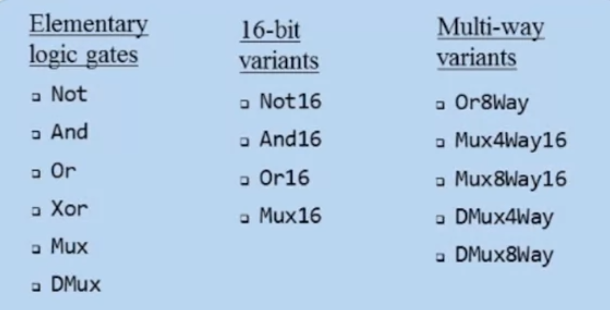
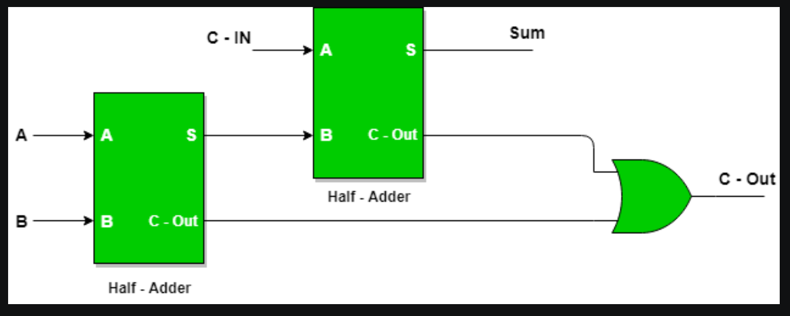
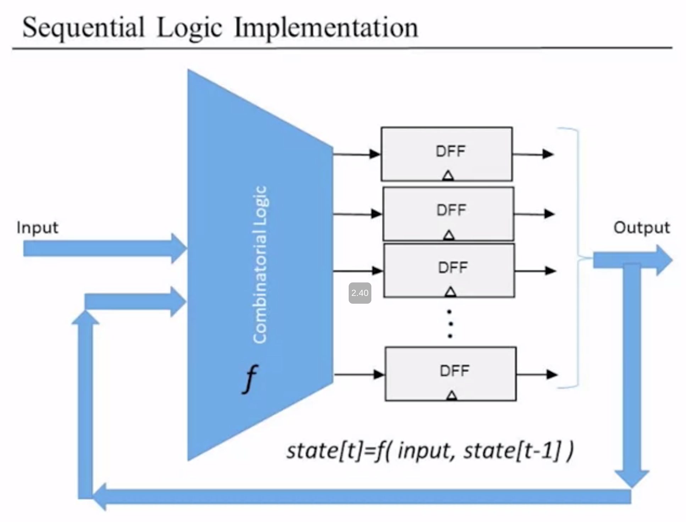
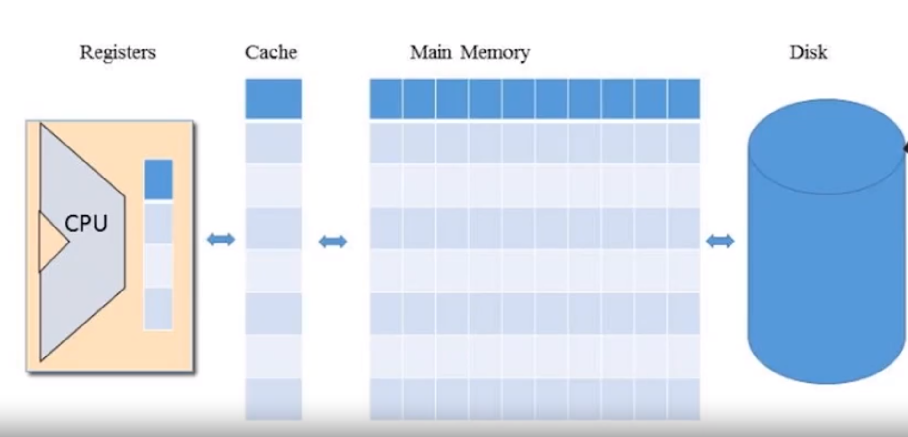
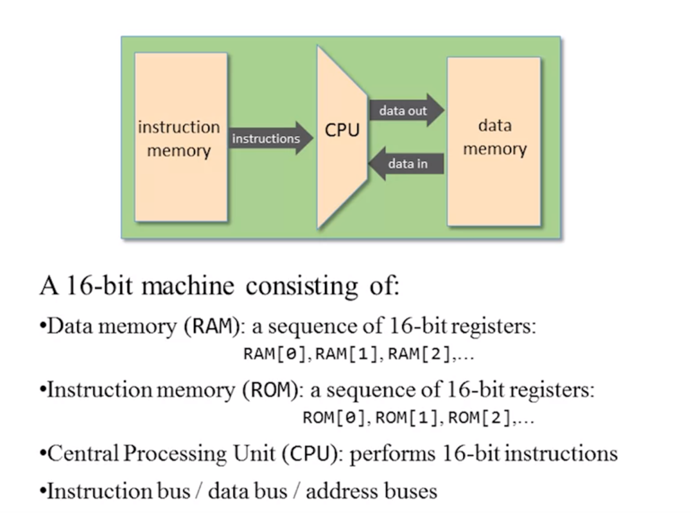
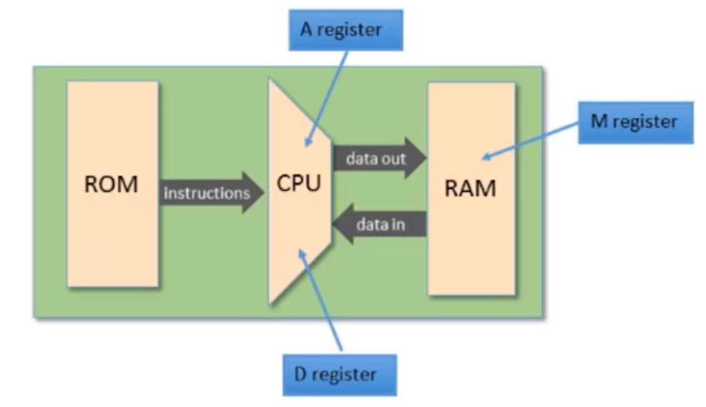
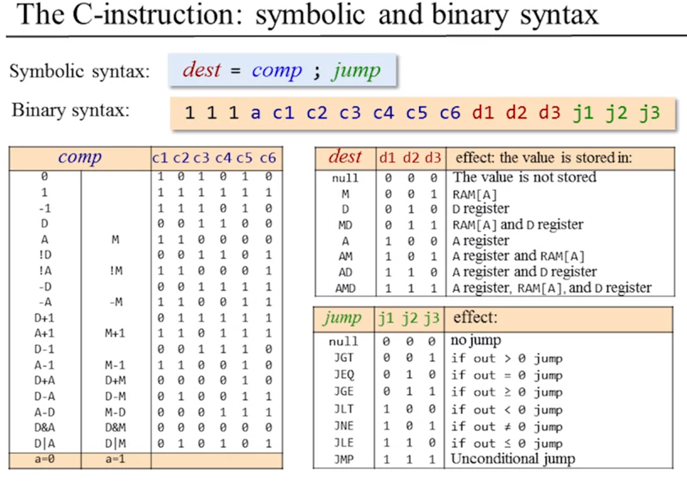
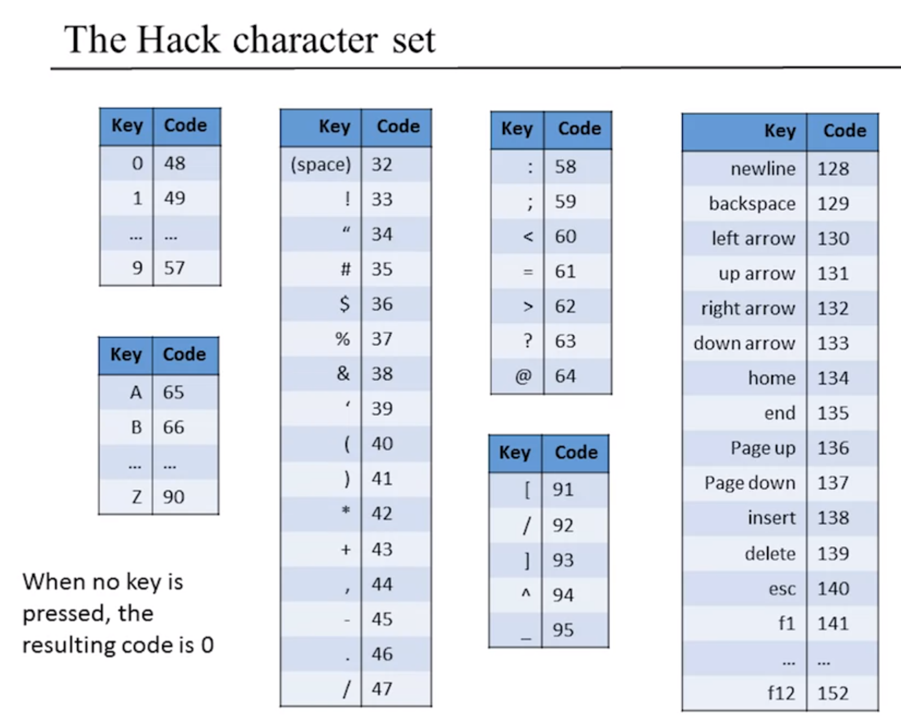

# NAND2Tetris Course
(Supplemented by notebook for basic notes and ideas)

## Roadmap
Pt. 1: Hardware
    Build HACK computer
        Silicon to low level code

        elementary logic units (NAND2 to DMUX8Way)
        |
        ALU (Half Adders to ALU)
        |
        Registers and Memory (Bit Memory to Program Counter)
        |
        Computer Architecture (Memory > CPU > Computer)
        |
        Low Level Programs
        |
        Assembler
Pt. 2: Software
    Create full SW hierarchy to run Tetris
        Low level code to Tetris
### Unit 0:
    Abstraction Layers!
    NAND2: y = a' * b'
        a   b   y
        0   0   1
        0   1   1
        1   0   1
        1   1   0

### Unit 1:
#### 1.4 Hardware Description Language (HDL)
    /** Comments here **/

    CHIP Xor {
        in a, b;
        out out;
        // =========================== interface ^
        // Must specify input first then output

    /* First breakdown the truth table you want to implement into all the wires that make it up.
        For instance, xXORy = x'y + xy' which means:
            The out is connected to an OR gate with inputs x'y and xy'
            The out_x'y is connected to an AND gate with inputs x' and y
            The out_xy' is connected to an AND gate with inputs x and y'
            The the out_x' is connected to a NOT gate with input x
            The the out_y' is connected to a NOT gate with input y

            Once you get to the primitive wires, stop and work backwards
            Needed wires: notx, noty, xy', x'y

        (we're using a, b, and out instead of x and y...) **/

        PARTS:
            Not (in=a, out=nota);
            Not (in=b, out=notb);

            And (a=nota, b=b, out=notaAndb);
            And (a=a, b=notb, out=aAndNotb);

            Or (a=aAndNotB, b=notaAndb, out=out);

        // =========================== implementation ^
    }

HDL has infinite FANOUT; meaning it can output any number of a wire instantaneously. (No driving requirements!)

Gate implementation convention:
    function(a=first_input, b=second_input, ..., out=final_output)

#### 1.4 & 1.5 Hardware Simulation
To verify the values of internal and external outputs.
Script based simulation:

    load file_to_be_tested.hdl;
    output-file output_of_test.out;
    set a 0, set b 0, eval, output;
    set a 0, set b 1, eval, output;
    set a 1, set b 0, eval, output;
    set a 1, set b 1, eval, output;

Comparing our output file to a predefined goal file makes testing the performance of our chip less overwhelming for chips with a large number of inputs.

Add this section to your test file along with the pre-populated truth table:

        compare-to output-expectations.cmp,

after selecting the output file on the second line (don't separate the lines with a semicolon, just a comma).

#### 1.6 Multi-bit Buses
Think of a group of bits as a single entity called a **bus**.
In HDL, buses are handled by ___________

For instance, a 16-bit adder gets treated like 2 16-bit numbers are going into it instead of 32 individual lines carrying a sigle bit each.

Skeleton Code:

        /* Add 2 16-bit numbers */
        CHIP Add16{
            IN a[16],
               b[16];
            OUT out[16];

            PARTS:
                //...
        }

To add a third input to this adder,

        CHIP Add3Way16{
            IN a[16], b[16], c[16];
            OUT out[16];

            PARTS:
                Add (a=a, b=b, out=out1);
                Add (a=c, b=out1, out=out);
        }

Working with buses:

1. To access the i'th bit, simply a[i]=element
2. To access a sub-range j to k, a[j..k]=sub_section
3. Use the boolean values 'true' or 'false' to set all the values of the bits in a bus to 1 or 0 respectively

#### 1.7 Programmable Gates
Building a MUX:

    /* 2 input MUX */
    CHIP Mux{
        IN a, b, sel;
        OUT out;

        PARTS:
        Not (a=sel, out=sel_bar);
        And (a=sel, b=b, out=selANDb);
        And (a=sel_bar, b=a, out=sel_barANDa);
        Or (a=selANDb, b=sel_barANDa, out=out);
    }

MUXes to build programmable gates:
eg. AndMuxOr

    /*    Act as an and gate when select is 0 and or gate when select is 1 */
    CHIP AndMuxOr {
        IN a, b, sel;
        OUT out;

        PARTS:
        And (a=a, b=b, out=aANDb);
        Or (a=a, b=b, out=aORb);
        Mux (a=aANDb, b=aORb, sel=sel, out=out);
    }

De-Multiplexor
Takes an input and distributes it to N outputs depending on the select

    /* DeMux */
    CHIP DMux {
        IN in, sel;
        OUT a, b;

        PARTS:
        Not (a=sel, out=sel_bar);
        And (a=in, b=sel_bar, out=a);
        And (a=in, b=sel, out=b);
    }

##### Bus operations:
16-bit Variants of elementary gates:

    /* And16 */
    CHIP And16 {
        IN a[16], b[16];
        OUT out[16];

        PARTS:
        And (a=a[0], b=b[0], out=out[0]);
        And (a=a[1], b=b[1], out=out[1]);
        And (a=a[2], b=b[2], out=out[2]);
        And (a=a[3], b=b[3], out=out[3]);
        And (a=a[4], b=b[4], out=out[4]);
        And (a=a[5], b=b[5], out=out[5]);
        And (a=a[6], b=b[6], out=out[6]);
        And (a=a[7], b=b[7], out=out[7]);
        And (a=a[8], b=b[8], out=out[8]);
        And (a=a[9], b=b[9], out=out[9]);
        And (a=a[10], b=b[10], out=out[10]);
        And (a=a[11], b=b[11], out=out[11]);
        And (a=a[12], b=b[12], out=out[12]);
        And (a=a[13], b=b[13], out=out[13]);
        And (a=a[14], b=b[14], out=out[14]);
        And (a=a[15], b=b[15], out=out[15]);
    }

Mux4Way16

Now, going in order, we'll construct each of these gates using NAND2 and the previous gates we've built.

To construct a multi-bus version of a gate, imagine building the same one N times with no change!
eg. A Mux16 is simply 16 Mux `(a=a[i], b=b[i], out=out[i]);`
To do 4 way Mux, combine 2 stages of 2 way Muxes as such:
stage 1: two regular 2 way Muxes controlled by sel[0],
stage 2: one regular 2 way Mux controlled by sel[1].

Any 2^n order Mux can be constructed using 2 stages where stage 1 has two 2^(n-1) Muxes and the last stage has one 2 way Mux.

***
### Unit 2:
Addition:
Half adders have no memory of previous carry bit
`sum = aXORb, carry=aANDb`
Full adders have an input for previous carry
`sum = aXORbXORc, carry = aXANDb + aXANDc` (There has to be a better way to implement this in boolean logic).

A full adder can be built from 2 half adders as such:

The Hack ALU:

| Op          |  OPCODE   |
| ----------  |  -------- |
|     0       |   0x2A    |
|     1       |   0x3F    |
|    -1       |   0x3A    |
|     x       |   0x0C    |
|     y       |   0x30    |
|    !x       |   0x0D    |
|    !y       |   0x31    |
|    -x       |   0x0F    |
|    -y       |   0x33    |
|   x+1       |   0x1F    |
|   y+1       |   0x37    |
|   x-1       |   0x0E    |
|   y-1       |   0x32    |
|   x+y       |   0x02    |
|   x-y       |   0x13    |
|   y-x       |   0x07    |
|   x&y       |   0x00    |
|   x|y       |   0x15    |

Table 1. Available operations on the Hack ALU

### Unit 3:
#### 3.1 Sequential Logic
        min clock cycle = propagation delays + combinatoral delay
Sequential logic has the output out[t] depend on the previous output out[t-1]

We can use states to make the same hardware do different tasks.
        state[n] = function(state[n-1])

#### 3.2 Flip Flops
Circuits that can remember one bit of information during a transition.
In a pipeline, no states are saved but rather passed onto the next combinatoral logic block in a chain to the output.
In a finite state machine, the state at one instance is input to the combinatoral block that made it and contributes to the next state.

*REGISTERS*
4 inputs: clock, in, out, and load.
If load[n-1], out[n]=in[n-1]
else, out[n]=out[n-1]

#### 3.3 Memory Units
In the von Neumann architecture, the memory registers connect to the ALU.

## Ram Abstraction
A sequence of n addressible registers pointed by an address input log(n) bits wide. Each register in the RAM has one word of data (16 bits in the Hack computer's case => 4 address bits).
To read, set address to the location of the register and advance one clock cycle. *Only one register is accessed at a single time.*

To write, set address to location of register, set input to write value, then assert load (load=1). The write value is passed onto the register.
#### 3.4 Counters
A program counter has 6 inputs: load, reset, increment, input, clock and address.
When inc is asserted, out[n+1]=out[n]+1 after each clock cycle.
When reset is asserted, out[n+1]=0.
### Unit 4: Machine Languages
#### 4.2 Elements 
Arithmetic operations: add, inc, ...
Logical operations: and, or, ...
Flow control operations: if x goto y, ...

### Memory Hierarchy
Accessing memory locations is expensive. The smaller the memory going into the CPU, the faster access times we can get.

CPU <--> Registers >> Cache >> Main memory >> Disk
The CPU can access the registers very quickly. The registers can store data or point to memory addresss in another memory bank
        store R1, @A; tells the computer to store the value of register R1 in a location of RAM given by the contents of register A.

**Addressing Modes**
1. Register
        Add R1, R2; R2 = R2 + R1
1. Direct
        Add R1, M[200]; M[200] is a memory unit in RAM, M[200] = M[200] + R1
1. Indirect
        Add R1, @A; M[A] = M[A] + R1
1. Immediate
        Add 714, R1; R1 = R1 + 714

**Flow Control**
Such as `jump 102` which takes the program counter to the 102th instruction location every time the PC gets to this instruction. Or a conditional jump statement.

#### The Hack Language

The RAM units are the data storage blocks.
Controlling the computer happens as so:
    The ROM is loaded with a program
    The reset button is pressed
    The program starts running

CPU Registers:
D - data register
A - address register
M - register holding the value of one address in RAM specified by A.

Setting A automatically sets M as the value of M only depends on the location pointed to by A.

Syntax of A:
        @1242; sets the location to 1242 and the value of M to whatever is stored in RAM location 1242
This is how we load and store values from our memory.

To store the value 0x1000 in register 0x3FF,
        @0x3FF; sets the location and the value of M
        M=0x1000;

!! M isn't a copy of whatever value is stored in the RAM location so it could be closer to the CPU, it is the actual memory register itself !!
        M=RAM[A]

## THE C INSTRUCTION
The Hack machine language is made out of 16-bit A or C instructions.
(There is also a reset button used to start program execution.)

        dest = comp; jump

jump and dest are optional instructions
when executing this instruction, a computation is made after which some value is stored in a register or the program jumps to another instruction.

Comp can be any of the following instructions done on the A, D, and M registers:

|                              |
--------------------------------
| 0, 1, -1, D, A, M,           |
| !D, !A, !M,                  |
| -D, -A, -M,                  |
| D+1, A+1, M+1, D-1, A-1, M-1,|
| D+A, D+M, D-A, D-M,          |
| A-D, M-D,                    |
| D&A, D&M,                    |
| D|A, D|M                     |
--------------------------------
|                              |

There are 8 possible destinations:
* null - don't store computation in memory
* M
* D
* A
* AM - in both A and M
* AD
* MD
* AMD - in all registers

Jump conditions compare the output to zero and jump *to the instruction given by the value of A register*:
* null - don't jump
* JEQ - Jump (if) EQual
* JNE - Jump (if) Not Equal
* JGT - Jump (if) Greater Than
* JLT
* JGE - Jump (if) Greater than or Equal
* JLE
* JMP - Jump regardless

Some examples:
        // Set RAM[300] to the value of D -1
        @300 // A instruction to set M to the location RAM[300]
        M = D-1 // Selected RAM location now loaded with value D-1

        // If D - 1 is zero, jump to execute instruction stored in ROM[56]
        @56     // A = 0x0038 
        D - 1; JEQ      // Jump to instruction 0x0038 if D-1=0

#### 4.4
Writing assembly can be done symbolically as shown above or using a binary syntax where we describe the instruction as a 16-bit code.

Binary Syntax:
The MSB is our opcode: it says whether the instruction is A (0) or C(1).
For A instructions, it is sufficient to simply state the memory location we want to address:

@100 // is equivalent to ...
0000000001100100

In the C instructions, the 14th and 15th bits are not used for anything and are just left as 1s. There are 3 bits to represent the 8 destination locations as well as 3 bits for the 8 possible jump instructions.

#### 4.5 I/O
We need a screen and keyboard at the minimum.
Their values are both stored in a dedicated sector of the RAM.

## Screen Memory Map
To display a 256x512 pixel screen (2^17),
we'll need to assign a bit to each pixel.
That means our screen memory map needs to be:
$$ \frac{2^{17}\ bits}{2^4\ bits\ per\ word} = 8KB\ of\ memory  $$

Our screen chip is simply an 8K RAM module that is a part of our bigger memory chip.

(Our system is 16 bits meaning all our registers only work on 16 bit values i.e. you can't just change one bit on the memory you'll have to change the entire word - R/W operations all work on words).

To set a pixel on/off we have to find what bit controls it by mapping from (pixel row, pixel col) to our 8KB memory location.

$$ pixel\ \# = row * 512 + col \newline
    word\ position = \frac{pixel\ \#}{16} \newline
    word\ position = 32*row + \frac{col}{16} \newline
    bit\ position = col\mod 16
$$

However, since the Screen memory is only a part of the bigger RAM that's been assigned to start at memory location 0x4000 (16K), we have to offset by 16K

$$ bit\ position = 16,384 + 32*row + \frac{col}{16}$$

Load the word location from the RAM to M using A, set the col % 16 th bit to 0 or 1 (perhaps by OR16-ing it with a mask...) and store back into M.

## Keyboard
A keyboard only needs one word to store all possible states. **Set to be RAM location 24,576.** Only when the key is pressed, the register is set to the value of the character set that corresponds to that key. (eg. if A is pressed, code=65, register = 0x0041)

To check whether a key is pressed, we probe the contents of the Keyboard chip (register).

#### 4.6 Hack programming
## Working with Registers and Memory
Load
        
        // set D = 10
        @10
        D=A

        // D = RAM[17]
        @17
        D=M

Store

        // RAM[1234] = D
        @1234
        M=D
    
        // RAM[1234] = 10
        @10
        D=A
        @1234
        M=D

        // RAM[5] = RAM[3]
        @3
        D=A
        @5
        M=D

## Some basic programs

        // Compute RAM[2] = RAM[1] + RAM[0]
        // dest = comp; jmp
        @0
        D=M  // D = RAM[0]
        @1
        D=D+M  // D+= RAM[1]
        @2
        M=D  // M = RAM[2] = RAM[0] + RAM[1]

Terminating a program properly:
To stop the PC from going down in our memory and executing unwanted instructions, we can start a small loop after all our programs as such:

        //prog
       0 ...
       1 ...
       2 ...
       3 ...
       .
       .
       .
       47 @47
       48 0; JMP // jump to the memory location 47

## Built in symbols:
Virtal registers: R0-15. Registers symbolically correspond to the first 16 addresses in the memory.
Why?

        // To make RAM[5] = 14389
        // instead of doing the follg
        @14389
        D=A
        @5
        M=D

        // Do this
        @14389
        D=A
        @R5
        M=D
        // To make what we're doing less ambiguous

## Branching
eg

        // R0 > 0 ? (R1=1):(R1=0)
        1 @R0
        2 D=M

        3 @9
        4 D; JGT // If D(=R0) > 0, jump to 9

        5 @R1  // If you reach here then R0 < 0
        6 M=0  
        7 @11
        8 0; JMP  // Set R0 to zero; start inf loop

        9 @R1
        10 M=1

        11 @10
        12 0; JMP

### Symbolic references
Declare a meaningful label instead of a number to jump to so you understand what you're doing.

@LABEL is equivalent to @n

Put (LABEL) above the line of code you want to branch to in order to jump to that line.

        // R0 > 0  ? (R1=1):(R1=0)
        @R0
        D=M

        @POSITIVE_CASE
        D; JGT

        @R1
        M=0
        @END_PROG
        0; JMP

    (POSITIVE_CASE)
        @R1
        M=1

    (END)
        @END
        0; JMP

Variables: Use @var_name to assign a random memory location after register 15 that's not being used by the program to use for storing values.
A branching symbol has a label declaration somewhere in the program while a variable doesn't.

## Iteration
